# Hi there! I'm Naveen raj (naviixraj) 👋

<picture>
  <source media="(prefers-color-scheme: dark)" srcset="dark.svg">
  <source media="(prefers-color-scheme: light)" srcset="light.svg">
  
</picture>

---

### 💻 About Me
I am a passionate **Frontend Engineer**, **Full Stack Developer**, **Prompt Engineer**, and **UI/UX Enthusiast** based in Tamil Nadu, India. I specialize in building highly interactive web applications, crafting clean responsive interfaces, and writing robust scalable codebase systems.

* 🎓 **Education**: B.Tech in Information Technology
* 🚀 **Current Focus**: Enhancing **NexTrack**, an enterprise student tracking PWA system.
* ✍️ **Hobbies**: Coding clean layouts, tweaking dotfiles, exploring AI automation pipelines.
* ✉️ **Contact**: [naveenraj7756@gmail.com](mailto:naveenraj7756@gmail.com)

---

### 🛠️ Tech Stack & Skills
* **Languages**: JavaScript, TypeScript, Python, HTML5, CSS3, SQL
* **Frontend**: React, Next.js, TailwindCSS, PWA architectures
* **Backend & Cloud**: Node.js, Firebase (Auth/Realtime Database), PostgreSQL, AWS Services
* **Developer Tools & Workflows**: Git & GitHub, Docker, Figma, VS Code, Linux Environments

---

### 📁 Featured Project: NexTrack
> **NexTrack** is a modern student movement tracking system designed for hostel management. It provides secure authentication, real-time data synchronization, and role-based dashboards for students and admins.

* **Key Implementations**: PWA offline capabilities, anonymous Firebase auth, real-time sync, and location validation.
* **Repository**: [naviixraj/Nextrack](https://github.com/naviixraj/Nextrack)

---

### 📊 GitHub Analytics

  
  

---

### 🤝 Let's Connect
* 💼 [LinkedIn](https://www.linkedin.com/)
* 🐦 [Twitter/X](https://twitter.com/)
* 🌐 [Portfolio Website](https://naviixraj.github.io/Nextrack)
